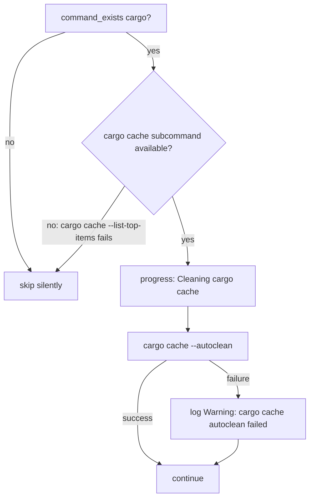

# Design Document: cache-cleanup

## Overview

This spec adds five cache-purge commands to `htotheizzo.sh`, each placed immediately after the corresponding tool's existing update block. The additions follow the exact updater-block pattern already used throughout the script: `command_exists` gate → `progress()` event → command → `|| log "Warning: ..."` fallback.

**Purpose**: Ensure that a single htotheizzo run also reclaims disk space from stale pip wheels, uv package downloads, Docker builder layers, yarn module cache, and cargo registry artifacts.

**Users**: Developers who run htotheizzo for periodic system hygiene. The cache purge happens transparently as part of the normal update pass.

**Impact**: Modifies `htotheizzo.sh` only. Five discrete, co-located additions with no change to existing logic, skip flags, or progress architecture.

### Goals

- Add `pip cache purge` / `pip3 cache purge` after pip update blocks
- Add `uv cache clean` after uv self-update block
- Add `docker builder prune -f` after `docker system prune` inside the running-daemon guard
- Add `yarn cache clean` after yarn update block
- Add `cargo cache --autoclean` (soft — only when `cargo-cache` crate is installed) after cargo update block

### Non-Goals

- No new skip flags
- No changes to existing update logic, existing cache-clean calls (npm, Composer, Pipenv), or system-level cleanup
- No GUI changes
- No test.sh additions beyond verifying the script passes

## Boundary Commitments

### This Spec Owns

- The five cache-purge additions in `htotheizzo.sh`
- Placement decisions: immediately after each tool's update block, within the existing `command_exists` guard
- `progress()` emission for each new cache-purge step

### Out of Boundary

- `~/Library/Caches` and OS-level cache cleanup (script-cleanup)
- Changes to existing update blocks or existing cache-clean calls
- New skip flags or configuration changes
- GUI layer (`gui/`)

### Allowed Dependencies

- Existing `command_exists()` helper function
- Existing `progress()` helper function
- Existing `log()` helper function
- `maybe_run()` wrapper where mock-mode support is needed
- Existing `skip_pip`, `skip_pip3`, `skip_uv`, `skip_docker`, `skip_yarn`, `skip_cargo`, `skip_rustup` environment variables (read-only)

### Revalidation Triggers

- If the pip, uv, docker, yarn, or cargo update blocks are restructured by script-cleanup (upstream), placement of the cache-purge lines should be re-verified before merging this spec.
- If `command_exists` signature changes, all five additions need review.

## Architecture

### Existing Architecture Analysis

`htotheizzo.sh` uses a flat function structure: `update()` calls a sequence of `if command_exists <tool>; then ... fi` blocks. Each block:

1. Tests tool availability with `command_exists`
2. Emits `progress "<label>"` at the start of a logical section (not necessarily per-tool)
3. Runs update commands with `|| log "Warning: ..."` fallback
4. Respects `skip_<name>=1` environment variable (checked inline with `command_exists`)

The `command_exists` function already handles skip-flag checking. Checking `skip_pip=1` before running is already handled by the outer `command_exists pip` guard — htotheizzo's existing convention is that the skip flag prevents `command_exists` from returning true for that tool. Review of the actual implementation shows `command_exists` does NOT check skip flags — the existing blocks use a separate inline check pattern. New additions must match whichever guard style the surrounding block uses.

### Architecture Pattern & Boundary Map

This is a **Simple Addition** — five independent line-group insertions into an existing flat sequential script. No new abstractions, no new files.

```
htotheizzo.sh (modified)
├── update_python_tools section
│   ├── [existing] pip update block
│   │   └── [NEW] pip cache purge
│   └── [existing] pip3 update block
│       └── [NEW] pip3 cache purge
├── update_rust_tools section
│   └── [existing] cargo update block
│       └── [NEW] cargo cache --autoclean (soft)
├── JS/Node section
│   └── [existing] yarn update block
│       └── [NEW] yarn cache clean
├── uv section
│   └── [existing] uv self update block
│       └── [NEW] uv cache clean
└── docker section
    └── [existing] docker system prune (inside daemon-running guard)
        └── [NEW] docker builder prune -f
```

### Technology Stack

| Layer | Choice / Version | Role in Feature | Notes |
|-------|------------------|-----------------|-------|
| Shell | Bash 5+ | All logic | Existing script; no new runtime |
| pip | pip 20.1+ | Cache purge via `pip cache purge` | Available since pip 20.1 |
| pip3 | pip3 (any modern) | Cache purge via `pip3 cache purge` | Same API as pip |
| uv | any | Cache clean via `uv cache clean` | Documented uv subcommand |
| Docker | Docker CLI (any) | Builder layer purge via `docker builder prune -f` | `-f` skips confirmation prompt |
| yarn | v1 (classic) | Cache clean via `yarn cache clean` | yarn v1 only; Berry/v2+ use different commands but the command is backward-compatible |
| cargo-cache | optional crate | Artifact purge via `cargo cache --autoclean` | Not built-in; requires `cargo install cargo-cache` |

## File Structure Plan

### Modified Files

- `htotheizzo.sh` — Five in-place additions, each immediately after the respective tool's update commands inside the existing `command_exists` guard block.

No new files are created. No files are deleted.

### Precise Insertion Points

| Tool | Insertion point (after) | New line(s) |
|------|------------------------|-------------|
| pip | After `export PIP_REQUIRE_VIRTUALENV=true` at the end of the pip update block (inside `if command_exists pip`) | `progress "Purging pip cache"` + `pip cache purge \|\| log "Warning: pip cache purge failed"` |
| pip3 | After `export PIP_REQUIRE_VIRTUALENV=true` at the end of the pip3 update block (inside `if command_exists pip3`) | `progress "Purging pip3 cache"` + `pip3 cache purge \|\| log "Warning: pip3 cache purge failed"` |
| uv | After `uv self update \|\| log "Warning: uv self update failed"` in the uv update block (covers both the Homebrew-skip branch and the standalone branch, immediately before the closing `fi`) | `progress "Cleaning uv cache"` + `uv cache clean \|\| log "Warning: uv cache clean failed"` |
| docker | After `docker system prune -af --volumes \|\| log "Warning: docker system prune failed"` inside the `if docker info &>/dev/null; then` daemon-running guard in the docker cleanup block | `progress "Pruning Docker builder cache"` + `docker builder prune -f \|\| log "Warning: docker builder prune failed"` |
| yarn | After all yarn update branches complete, immediately before the closing `fi` of the `if command_exists yarn` block (after `yarn global upgrade --latest` / npm / corepack branches) | `progress "Cleaning yarn cache"` + `yarn cache clean \|\| log "Warning: yarn cache clean failed"` |
| cargo | After `cargo install-update -a \|\| log "Warning: cargo install-update failed"` at the end of the `if command_exists cargo` block | soft-check pattern (see Components) |

## System Flows

### cargo-cache soft-check pattern



Two detection patterns were considered for the soft-check:

- **Rejected**: `if cargo cache --list-top-items &>/dev/null 2>&1; then` — probes by invoking the subcommand with a read-only flag. This would fail fast if the subcommand is absent, but it introduces a different detection idiom not present elsewhere in the script.
- **Chosen**: `cargo install --list | grep -q "cargo-cache"` — checks the installed crate list. This is the exact pattern already used in the same `command_exists cargo` block to detect `cargo-update` (see the `cargo install-update` guard). Using the same idiom keeps the block internally consistent and avoids an additional subprocess invocation of an unknown subcommand.

## Requirements Traceability

| Requirement | Summary | Insertion point in htotheizzo.sh |
|-------------|---------|----------------------------------|
| 1.1–1.3 | pip cache purge | End of `command_exists pip` block — after `export PIP_REQUIRE_VIRTUALENV=true` closing the pip update block |
| 1.4–1.6 | pip3 cache purge | End of `command_exists pip3` block — after `export PIP_REQUIRE_VIRTUALENV=true` closing the pip3 update block |
| 2.1–2.3 | uv cache clean | End of `command_exists uv` block — after `uv self update || log "Warning: uv self update failed"` (and its Homebrew-skip branch) |
| 3.1–3.4 | docker builder prune | After `docker system prune -af --volumes || log "Warning: docker system prune failed"` inside the daemon-running guard in the docker cleanup block |
| 4.1–4.3 | yarn cache clean | End of `command_exists yarn` block — after `yarn global upgrade --latest` / all yarn update branches complete |
| 5.1–5.4 | cargo cache autoclean | End of `command_exists cargo` block — after the `cargo install-update -a` / cargo-update logic |
| 6.1–6.5 | Pattern conformance | All five insertion points |

## Components and Interfaces

| Component | Intent | Req Coverage | Notes |
|-----------|--------|--------------|-------|
| pip cache purge block | Purge pip download/wheel cache | 1.1–1.3, 6.1–6.5 | Inside existing `command_exists pip` guard |
| pip3 cache purge block | Purge pip3 download/wheel cache | 1.4–1.6, 6.1–6.5 | Inside existing `command_exists pip3` guard |
| uv cache clean block | Clean uv package cache | 2.1–2.3, 6.1–6.5 | Inside existing `command_exists uv` guard |
| docker builder prune block | Prune Docker builder layer cache | 3.1–3.4, 6.1–6.5 | Inside existing docker daemon-running guard; emits `progress()` per Pattern conformance |
| yarn cache clean block | Clean yarn v1 module cache | 4.1–4.3, 6.1–6.5 | Inside existing `command_exists yarn` guard |
| cargo cache autoclean block | Auto-clean cargo registry/artifacts | 5.1–5.4, 6.1–6.5 | Soft-check inside existing `command_exists cargo` guard |

### Shell Script Layer

#### pip cache purge block

| Field | Detail |
|-------|--------|
| Intent | Purge pip's download and wheel cache after pip package updates |
| Requirements | 1.1, 1.2, 1.3, 6.1, 6.2, 6.3, 6.4, 6.5 |

**Responsibilities & Constraints**
- Runs only inside the existing `if command_exists pip; then` block
- Placed after `export PIP_REQUIRE_VIRTUALENV=true` at the end of the pip block
- Must not run when `skip_pip=1` (handled by surrounding guard)

**Implementation Notes**
```bash
progress "Purging pip cache"
pip cache purge || log "Warning: pip cache purge failed"
```

#### pip3 cache purge block

| Field | Detail |
|-------|--------|
| Intent | Purge pip3's download and wheel cache after pip3 package updates |
| Requirements | 1.4, 1.5, 1.6, 6.1, 6.2, 6.3, 6.4, 6.5 |

**Implementation Notes**
```bash
progress "Purging pip3 cache"
pip3 cache purge || log "Warning: pip3 cache purge failed"
```

#### uv cache clean block

| Field | Detail |
|-------|--------|
| Intent | Clean uv's package download cache after uv self-update |
| Requirements | 2.1, 2.2, 2.3, 6.1, 6.2, 6.3, 6.4, 6.5 |

**Responsibilities & Constraints**
- Runs inside the existing `if command_exists uv; then` block
- Runs regardless of whether uv was Homebrew-managed or standalone (uv cache clean is always valid)
- Placed after the self-update branch ends (both the Homebrew-skip branch and the `uv self update` branch)

**Implementation Notes**
```bash
progress "Cleaning uv cache"
uv cache clean || log "Warning: uv cache clean failed"
```

#### docker builder prune block

| Field | Detail |
|-------|--------|
| Intent | Prune Docker's builder layer cache (separate from `docker system prune`) |
| Requirements | 3.1, 3.2, 3.3, 3.4, 6.1, 6.2, 6.3, 6.4, 6.5 |

**Responsibilities & Constraints**
- Runs inside the existing `if docker info &>/dev/null; then` daemon-running guard
- Placed immediately after `docker system prune -af --volumes || log "Warning: docker system prune failed"`
- Must emit a `progress()` call for Pattern conformance (Requirement 6.1); the docker cleanup section has a broad scope and builder prune is a distinct operation
- Does not run for the `podman` branch

**Implementation Notes**
```bash
progress "Pruning Docker builder cache"
docker builder prune -f || log "Warning: docker builder prune failed"
```

#### yarn cache clean block

| Field | Detail |
|-------|--------|
| Intent | Clean yarn v1 module cache after yarn update |
| Requirements | 4.1, 4.2, 4.3, 6.1, 6.2, 6.3, 6.4, 6.5 |

**Responsibilities & Constraints**
- Runs at the end of the existing `if command_exists yarn; then` block, after all yarn update branches
- `yarn cache clean` is backward-compatible with yarn v1 and yarn v2+ Berry

**Implementation Notes**
```bash
progress "Cleaning yarn cache"
yarn cache clean || log "Warning: yarn cache clean failed"
```

#### cargo cache autoclean block (soft check)

| Field | Detail |
|-------|--------|
| Intent | Auto-clean cargo registry and artifact caches when cargo-cache crate is installed |
| Requirements | 5.1, 5.2, 5.3, 5.4, 6.2, 6.3, 6.4, 6.5 |

**Responsibilities & Constraints**
- Runs inside the existing `if command_exists cargo; then` block
- Must not error or warn when `cargo-cache` is not installed
- Use `cargo install --list | grep -q "cargo-cache"` probe (matches existing pattern for cargo-update in the same block)

**Implementation Notes**
```bash
if cargo install --list | grep -q "cargo-cache"; then
  progress "Cleaning cargo cache"
  cargo cache --autoclean || log "Warning: cargo cache autoclean failed"
fi
```

## Error Handling

### Error Strategy

All cache-purge commands use the `|| log "Warning: ..."` pattern consistent with the rest of the script. Failures are non-fatal: they log a warning and the script continues. This is the established htotheizzo error contract.

### Error Categories and Responses

| Error | Response |
|-------|----------|
| Tool not installed | Silent skip via `command_exists` guard |
| Docker daemon not running | Silent skip via existing `docker info` guard |
| `cargo-cache` not installed | Silent skip via `cargo install --list` probe |
| Cache purge command fails | `log "Warning: <tool> cache <operation> failed"` and continue |

## Testing Strategy

### Script Correctness Tests

- Run `./test.sh` and confirm the script passes — this is the primary acceptance gate.
- Run `MOCK_MODE=1 ./htotheizzo.sh` and verify: (a) no new errors appear, (b) `PROGRESS:Purging pip cache`, `PROGRESS:Cleaning uv cache`, `PROGRESS:Cleaning yarn cache`, and `PROGRESS:Cleaning cargo cache` lines appear in output when respective tools are available.

### Unit-style checks (manual)

- Verify `skip_pip=1 ./htotheizzo.sh` does not run `pip cache purge`.
- Verify that on a system without `cargo-cache` installed, no warning is emitted for cargo cache.
- Verify that `docker builder prune -f` only runs when `docker info` succeeds.

### Pattern conformance review

- Code review confirms all five additions follow `command_exists` → `progress()` → command → `|| log "Warning: ..."` order.
- Confirm no new `skip_*` variables are introduced.
