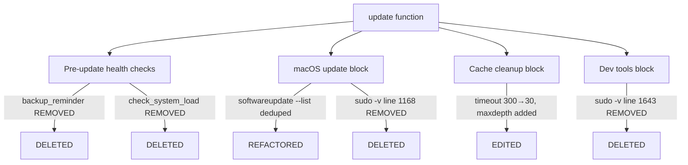
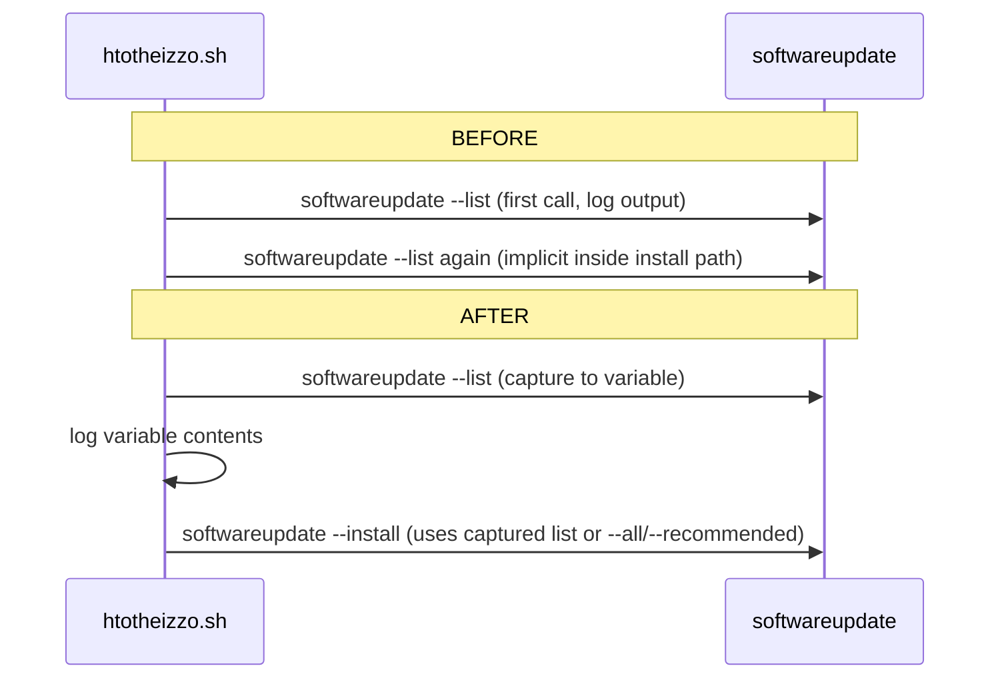

# Design Document — script-cleanup

## Overview

This feature removes three functions from `htotheizzo.sh` that are not established best practices (`check_system_load`, `backup_reminder`, `replace_sysd`), eliminates a redundant `softwareupdate --list` invocation, reduces an excessive cache-cleanup timeout, adds a depth limit to the `~/Library/Caches` find call, and removes two stray `sudo -v` lines that duplicate work already handled by the `keep_sudo_alive()` keepalive loop.

**Purpose**: This feature reduces per-run latency and noise in htotheizzo by deleting dead code and correcting performance regressions in the macOS maintenance path.

**Users**: Developers who run htotheizzo interactively or via cron will see a faster, quieter update pass.

**Impact**: Changes the current `htotheizzo.sh` by removing approximately 100 lines of function definitions and call sites, capping a timeout at 30 s, constraining a find depth, and removing two stray lines. No behavioral change is expected for any supported package manager.

### Goals

- Remove all non-best-practice functions and their call sites cleanly, leaving no dangling references.
- Eliminate the duplicate `softwareupdate --list` network call on macOS.
- Cap cache-cleanup find to 30 s and `-maxdepth 3` to prevent excessive I/O on large caches.
- Remove two stray `sudo -v` lines that are redundant with the active keepalive loop.
- Preserve `set -euo pipefail` correctness throughout.
- `test.sh` passes after all changes.

### Non-Goals

- Updating CLAUDE.md skip-flag documentation (tracked separately).
- Adding new cache cleanup commands (cache-cleanup spec).
- Any GUI, Windows, or Linux-specific changes.
- Changing test.sh itself.

## Boundary Commitments

### This Spec Owns

- Deletion of `check_system_load()`, its call site, and references to `skip_load_check`.
- Deletion of `backup_reminder()`, its call site, and references to `skip_backup_warning`.
- Deletion of `replace_sysd()` (no call site to remove; function only).
- Refactoring the `softwareupdate` block to capture `--list` output in a variable and reuse it.
- Reducing the timeout constant in all three cache-cleanup code paths from 300 to 30.
- Adding `-maxdepth 3` to the find call in all three cache-cleanup code paths.
- Removing the standalone `sudo -v` near line 1168 and the standalone `sudo -v` near line 1643.

### Out of Boundary

- CLAUDE.md and README documentation changes.
- Adding new cache cleanup commands (cache-cleanup spec owns that).
- `test.sh` logic changes.
- Any function or code path not explicitly listed above.

### Allowed Dependencies

- `htotheizzo.sh` as-is is the single upstream artifact; no external dependencies are introduced.
- `test.sh` is the validation harness; this spec must not break it.

### Revalidation Triggers

- If the cache-cleanup spec modifies the same find block, it must re-verify depth and timeout are still present after merging.
- If `keep_sudo_alive()` is ever removed or refactored, the sudo credential strategy must be re-evaluated.

## Architecture

### Existing Architecture Analysis

`htotheizzo.sh` is a monolithic Bash script with `set -euo pipefail`. Functions are defined in the upper half and called from `update()` and helpers in the lower half. There is no module system; changes are line-level edits within a single file.

The script's error-handling contract is: every fallible command ends with `|| log "Warning: ..."` so a failure logs but does not abort the run. This contract must be preserved.

The `keep_sudo_alive()` function is started as a background process before the main `update()` body and loops `sudo -v` every 60 s for the duration of the run. Any standalone `sudo -v` inside `update()` is therefore redundant.

### Architecture Pattern & Boundary Map

This feature is a **simple subtraction** — no new components, no new code paths. All changes are deletions and in-place edits within `htotheizzo.sh`.

### Technology Stack

| Layer | Choice / Version | Role in Feature | Notes |
|-------|------------------|-----------------|-------|
| Shell script | Bash (set -euo pipefail) | Only artifact changed | Must preserve strict mode |

## File Structure Plan

### Modified Files

- `htotheizzo.sh` — All seven changes listed below are in this single file.

### Change Map

| # | Location | Change type | Description |
|---|----------|-------------|-------------|
| 1 | Lines 236–281 | Delete block | `backup_reminder()` function definition |
| 2 | Line 1037 | Delete line | `backup_reminder` call site |
| 3 | Lines 572–610 | Delete block | `check_system_load()` function definition |
| 4 | Line 1041 | Delete line | `check_system_load` call site |
| 5 | Lines 711–717 | Delete block | `replace_sysd()` function definition |
| 6 | Lines 1090–1105 | Refactor block | Capture `softwareupdate --list` in variable; reuse for log and install |
| 7 | Lines 908–928 | Edit constants | Timeout 300 → 30; add `-maxdepth 3` to all three find invocations |
| 8 | Line 1168 | Delete line | Stray `sudo -v` after OS branch block |
| 9 | Line 1643 | Delete line | Stray `sudo -v` before gem update block |

## System Flows

The softwareupdate deduplication changes the macOS update block from two sequential `softwareupdate` calls to one:

## Requirements Traceability

| Requirement | Summary | Component | Change type |
|-------------|---------|-----------|-------------|
| 1.1, 1.2, 1.3, 1.4 | Remove check_system_load | htotheizzo.sh pre-check section | Delete function + call site |
| 2.1, 2.2, 2.3, 2.4 | Remove backup_reminder | htotheizzo.sh pre-check section | Delete function + call site |
| 3.1, 3.2 | Remove replace_sysd | htotheizzo.sh function block | Delete function |
| 4.1, 4.2 | Deduplicate softwareupdate --list | htotheizzo.sh macOS block | Refactor to variable capture |
| 5.1, 5.2 | Reduce cache timeout to 30 s | htotheizzo.sh cache cleanup | Edit timeout constant |
| 6.1, 6.2 | Add -maxdepth 3 to find | htotheizzo.sh cache cleanup | Edit find invocations |
| 7.1, 7.2, 7.3 | Remove stray sudo -v calls | htotheizzo.sh update function | Delete two lines |
| 8.1, 8.2 | test.sh passes | test harness | Validation only |

## Components and Interfaces

All changes are within the single `htotheizzo.sh` script. There are no new components or interfaces. The changes are grouped by concern below.

### Pre-update Health Checks Section

#### backup_reminder removal

| Field | Detail |
|-------|--------|
| Intent | Delete the function (lines 236–281) and its call site (line 1037) |
| Requirements | 2.1, 2.2, 2.3, 2.4 |

**Responsibilities & Constraints**
- The function body, including all `tmutil` invocations and references to `skip_backup_warning`, must be removed.
- The call site on line 1037 (`backup_reminder`) must be removed.
- No other code in the pre-check block must be disturbed.

**Implementation Notes**
- After deletion, `check_battery` remains the first call in the pre-check sequence.
- Verify no remaining reference to `skip_backup_warning` or `backup_reminder` exists in the file.

#### check_system_load removal

| Field | Detail |
|-------|--------|
| Intent | Delete the function (lines 572–610) and its call site (line 1041) |
| Requirements | 1.1, 1.2, 1.3, 1.4 |

**Responsibilities & Constraints**
- The entire function body including the CPU temperature sysctl block (lines 599–610) must be removed.
- The call site on line 1041 (`check_system_load`) must be removed.
- References to `skip_load_check` must not remain.

**Implementation Notes**
- After deletion, `estimate_update_sizes` becomes the next call after `check_disk_space` and `check_network` in the pre-check sequence.
- Verify no remaining reference to `skip_load_check` or `check_system_load` exists.

### Dead Code Section

#### replace_sysd removal

| Field | Detail |
|-------|--------|
| Intent | Delete the unreachable function (lines 711–717) |
| Requirements | 3.1, 3.2 |

**Responsibilities & Constraints**
- Lines 711–717 contain the full function. There is no call site; the grep confirms no callers.
- The blank line after line 717 may be collapsed but is not required.

### macOS Update Block

#### softwareupdate deduplication

| Field | Detail |
|-------|--------|
| Intent | Capture `softwareupdate --list` output in a local variable; log it; pass the list to the install step |
| Requirements | 4.1, 4.2 |

**Responsibilities & Constraints**
- The `--list` invocation must run exactly once; its stdout must be captured and logged.
- The install step (`--install --all` or `--install --recommended`) must not trigger a second `--list`.
- The `skip_softwareupdate` and `skip_softwareupdate_major` guard logic must be preserved unchanged.
- `set -euo pipefail` correctness: capture into a local variable with `|| true` or assignment-safe pattern to avoid aborting on non-zero list exit.

**Implementation Notes**
- Pattern: `local sw_list; sw_list=$(softwareupdate --list 2>&1 | grep -v "..." || true); log "$sw_list"`
- The install step does not consume `sw_list`; it calls `softwareupdate --install --all` or `--recommended` directly. The requirement is that `--list` is not called a second time, not that the install is driven from the captured list.

### Cache Cleanup Block

#### Timeout reduction and depth limit

| Field | Detail |
|-------|--------|
| Intent | Change timeout from 300 to 30 in all three branches; add `-maxdepth 3` to all three find invocations |
| Requirements | 5.1, 5.2, 6.1, 6.2 |

**Responsibilities & Constraints**
- Three code paths share this find pattern: `gtimeout` branch, `timeout` branch, and fallback (background process with manual loop).
- All three must be updated consistently: timeout constant 300 → 30, and `-maxdepth 3` added before the `\(` name-pattern group.
- The fallback branch's manual loop also uses 300 as its `$elapsed -lt N` ceiling — this must be changed to 30 as well.
- The `|| log "Warning: cache cleanup timed out or failed"` error handling must be preserved.

### Sudo Credential Hygiene

#### Remove stray sudo -v calls

| Field | Detail |
|-------|--------|
| Intent | Delete the two standalone `sudo -v` lines that are redundant with the keepalive loop |
| Requirements | 7.1, 7.2, 7.3 |

**Responsibilities & Constraints**
- Line 1168: `sudo -v  # Refresh sudo credentials` — the entire line including comment must be removed.
- Line 1643: `sudo -v  # Refresh sudo credentials` — the entire line including comment must be removed.
- The `keep_sudo_alive()` function and its invocation must not be touched.

## Error Handling

### Error Strategy

All changes are deletions or constant edits. No new error paths are introduced. The existing `|| log "Warning: ..."` fallback pattern must be preserved on all modified lines.

### Error Categories and Responses

- **Cache cleanup timeout (30 s)**: If find exceeds 30 s, the existing warning log fires and the run continues — same behavior as before, just triggered sooner.
- **softwareupdate --list failure**: Captured with `|| true` so a non-zero exit from `--list` does not abort the run; the logged output will be empty or contain the error text.

## Testing Strategy

### Shell Script Tests (test.sh)

- **Function removal verification**: `test.sh` should pass after all deletions, confirming no broken call sites remain.
- **softwareupdate block**: Run with `MOCK_MODE=1` to confirm the block executes without attempting a real network call; verify log output shows the list step exactly once.
- **Cache cleanup**: Run with `MOCK_MODE=1` on macOS to confirm find is invoked with `-maxdepth 3` and timeout 30.
- **sudo -v absence**: Verify via static analysis (grep) that no standalone `sudo -v` lines remain at the deleted positions.
- **Regression**: Full `./test.sh` run exits 0.
