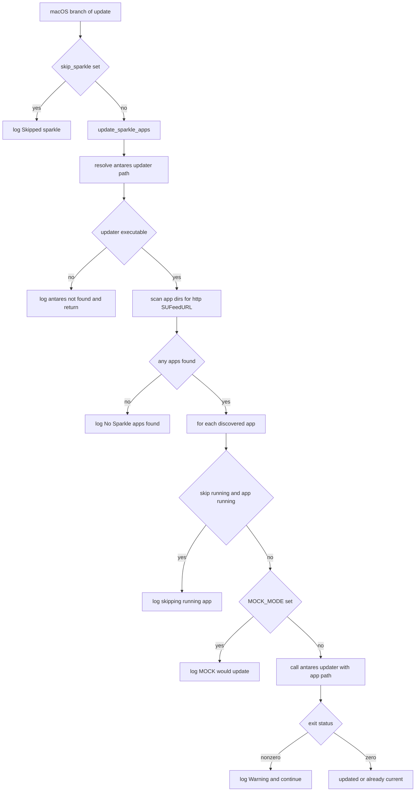

# Design Document

## Overview

**Purpose**: This feature gives htotheizzo the ability to update **Sparkle apps** — third-party macOS applications that self-update through the Sparkle framework and are not installed as Homebrew casks — during an unattended update run. It closes a real gap: these apps only update when launched and interactively prompted, so they silently fall stale after every run.

**Users**: Developers running htotheizzo by hand, from cron, from CI, or via the Electron GUI on macOS.

**Impact**: Adds one new macOS-only section to `update()`. The section discovers installed Sparkle apps and delegates each app's actual update to a colleague's external tool, **antares** (`bin/update-app.sh`), which already performs the appcast read, download, install, and relaunch. htotheizzo contributes discovery and orchestration only; antares is treated as an unmodified external dependency. The section behaves like every other htotheizzo block: a `skip_<name>=1` control, graceful per-item failure that never aborts the run, mock-mode safety, and inclusion in the end-of-run summary.

### Goals
- Discover every installed Sparkle app and bring each current by delegating to antares.
- Integrate using existing htotheizzo conventions (`skip_` guard, `|| log "Warning:"`, `progress`, `MOCK_MODE`) with zero new runtime dependencies in htotheizzo itself.
- Fail safe: a missing antares, a missing app feed, or a single failed app update never aborts the run.

### Non-Goals
- Modifying antares (appcast parsing, version comparison, download, install, relaunch all stay in `update-app.sh`).
- Report-only or dry-run-only modes (auto-update was the chosen behavior).
- Updating Sparkle apps that are Homebrew casks (already covered by the existing cask path).
- Linux/Windows support.
- A GUI checkbox for Sparkle (the GUI already passes `skip_*` env vars generically; a dedicated control is deferred).

## Boundary Commitments

### This Spec Owns
- A new `update_sparkle_apps()` helper in `htotheizzo.sh` and its single call site in the macOS branch of `update()`.
- **Discovery**: enumerating configured application directories and selecting `.app` bundles that declare an `http(s)` Sparkle feed (`SUFeedURL`).
- **Orchestration**: invoking the antares updater once per discovered app, with warning-tolerant error handling, mock-mode gating, and an optional running-app skip.
- **Resolution**: locating the antares updater via `ANTARES_DIR` with a default fallback, and skipping the whole section cleanly when it is absent.
- The new env controls: `skip_sparkle`, `skip_sparkle_running`, `ANTARES_DIR`, `SPARKLE_APP_DIRS`; their documentation in `CLAUDE.md` and `help()`; and the `test.sh` coverage for these paths.

### Out of Boundary
- Everything inside `update-app.sh`: appcast fetching, stable-version selection, version comparison, download, mount/extract, `/Applications` install, quarantine clearing, and quit/relaunch. htotheizzo never reimplements these.
- Determining *whether* an app is behind — delegated to `update-app.sh` (it no-ops when current).
- Sparkle apps managed by Homebrew casks; non-macOS platforms; any antares health-report or backup behavior.

### Allowed Dependencies
- **antares `bin/update-app.sh`** — public CLI: `update-app.sh <AppName|/path/App.app> [--dry-run]`. May depend only on this documented contract, never on antares' private internals (e.g. `_detail_sparkle` in `outdated.sh`).
- **Existing htotheizzo helpers**: `log()`, `progress()`, the `MOCK_MODE` convention, and `ERROR_LOG`/`show_error_summary()` wiring (a `Warning:`-prefixed `log` is auto-captured into the summary).
- **macOS built-ins**: `defaults`, `osascript`, the `/Applications` layout. Section is gated to run only on `darwin`.

### Revalidation Triggers
- `update-app.sh` changes its CLI argument shape, its "already current → exit 0" no-op behavior, or its exit-code contract.
- antares' canonical install location changes (affecting the `ANTARES_DIR` default).
- htotheizzo changes its `MOCK_MODE`, `progress`, or `ERROR_LOG`/summary conventions.
- The macOS branch of `update()` is restructured such that the call site moves.

## Architecture

### Existing Architecture Analysis
- `htotheizzo.sh` runs under `set -euo pipefail`. macOS feature blocks are extracted into `mac_*`/`update_*` functions defined **before** `update()` and called from the `[[ "$OSTYPE" == "darwin"* ]]` branch (e.g. `mac_disk_maintenance()` at line 816, called at line 1074).
- **Skip convention**: `command_exists()` (line 136) auto-checks `skip_<normalized>` for *command-backed* tools. Feature blocks that are **not a single command** (disk_maintenance, spotlight, launchpad) use an explicit `[[ -z "${skip_x:-}" ]]` guard at the call site. Sparkle is a feature, not a command, so it follows the explicit-guard pattern.
- **Failure model**: fallible calls end `|| log "Warning: ..."`. `log()` (line 21) appends any `Warning:`/`Error:` message to `ERROR_LOG`; `show_error_summary()` (line 37) prints them at the end. No additional summary wiring is required.
- **Mock mode**: `MOCK_MODE` (line 13) is always defined (`${MOCK_MODE:-}`), so it is safe to reference under `set -u`.
- **GUI**: `progress "<label>"` (line 75) emits `PROGRESS:<label>` consumed by the Electron parser.

### Architecture Pattern & Boundary Map
Selected pattern: **thin orchestrator delegating to an external CLI**. htotheizzo owns discovery + the loop; antares owns the per-app update. This keeps the dependency on antares' stable public surface and avoids duplicating Sparkle logic.



Key decisions (not obvious from the diagram): the running-app skip and mock gate live **in htotheizzo**, before delegation, because `update-app.sh` would otherwise quit/relaunch and install unconditionally. Everything past the `Invoke` node is owned by antares.

### Technology Stack

| Layer | Choice / Version | Role in Feature | Notes |
|-------|------------------|-----------------|-------|
| CLI / Shell | Bash 5+, `set -euo pipefail` | Hosts `update_sparkle_apps()` | New code; no new htotheizzo dependency |
| External tool | antares `bin/update-app.sh` | Performs each app's update | Unmodified; located via `ANTARES_DIR` |
| macOS built-ins | `defaults`, `osascript` | Read `SUFeedURL`; detect running app | Present on every macOS host |

## File Structure Plan

### Modified Files
- `htotheizzo.sh`
  - **Add** `update_sparkle_apps()` near the other `mac_*` helpers (after `mac_disk_maintenance()`, ~line 816+). Single responsibility: resolve antares, discover Sparkle apps, delegate each to the updater with warning-tolerant + mock-safe + running-aware handling.
  - **Add** the call site inside the `darwin` branch of `update()`, after the `mas` / Microsoft AutoUpdate block (~line 1070), guarded by `[[ -z "${skip_sparkle:-}" ]]` with an `else log "Skipped sparkle"` arm.
  - **Update** `help()` env-var examples to mention `skip_sparkle`.
- `test.sh`
  - **Add** `skip_sparkle=1` to `run_htotheizzo_fast()` so existing fast tests stay hermetic (no `/Applications` scan).
  - **Add** `test_sparkle_*` functions and register them in the runner.
- `CLAUDE.md`
  - **Add** `skip_sparkle`, `skip_sparkle_running`, and the `ANTARES_DIR` / `SPARKLE_APP_DIRS` (colon-separated) env vars to the skip-commands / configuration documentation.

No new files; the entire feature lives in the existing script plus its docs and tests, matching the project's flat, script-centric structure.

## Requirements Traceability

| Requirement | Summary | Component(s) | Realized by |
|-------------|---------|--------------|-------------|
| 1.1 | Enumerate apps, identify Sparkle feed | `update_sparkle_apps` (discovery) | Loop over `SPARKLE_APP_DIRS`, `defaults read Info SUFeedURL` |
| 1.2 | Only `http(s)` feeds in scope | `update_sparkle_apps` | `[[ "$feed" == http* ]]` filter |
| 1.3 | No feed → silent exclude | `update_sparkle_apps` | `\|\| continue` on `defaults read` failure; no error log |
| 1.4 | No apps → complete + report none | `update_sparkle_apps` | `found` flag → "No Sparkle apps found." |
| 2.1 | Invoke updater per app | `update_sparkle_apps` (delegation) | `"$updater" "$app"` per app |
| 2.2 | Already current → unchanged, continue | antares `update-app.sh` | Its built-in no-op (exit 0) |
| 2.3 | Behind → download/install/relaunch | antares `update-app.sh` | Delegated entirely |
| 2.4 | No parsing/compare/install in htotheizzo | Boundary | Out-of-boundary commitment |
| 3.1 | Resolve via `ANTARES_DIR` | `update_sparkle_apps` (resolution) | `${ANTARES_DIR:-default}/bin/update-app.sh` |
| 3.2 | Fallback default when unset | `update_sparkle_apps` | Default `$HOME/Developer/2026/antares` |
| 3.3 | Not found/not exec → skip + info, no fail | `update_sparkle_apps` | `[[ -x ]]` check → `log` + `return 0` |
| 4.1 | `skip_sparkle` → no discover/update | Call-site guard | `[[ -z "${skip_sparkle:-}" ]]` |
| 4.2 | `skip_sparkle` → no updater invocation | Call-site guard | Function not entered |
| 4.3 | Follows `skip_<name>` convention | Call-site guard | Mirrors disk_maintenance pattern |
| 5.1 | One app fails → warn + continue | `update_sparkle_apps` | `\|\| log "Warning: ..."` inside loop |
| 5.2 | No abort; strict-mode preserved | `update_sparkle_apps` | All fallibles guarded; no unguarded non-zero |
| 5.3 | Start/finish log consistent | `update_sparkle_apps` | `progress "Updating Sparkle apps"` + `log` emitted unconditionally at function entry, before any guard |
| 5.4 | Warnings in end-of-run summary | Existing `ERROR_LOG` | `Warning:`-prefixed logs auto-captured |
| 6.1 | macOS-only | Call-site placement | Inside `darwin` branch only |
| 6.2 | Non-interactive | `update_sparkle_apps` | No prompts; delegates headlessly |
| 6.3 | Mock → no download/install | `update_sparkle_apps` | `MOCK_MODE` gates the `update-app.sh` call |
| 6.4 | GUI progress label | `update_sparkle_apps` | `progress "Updating Sparkle apps"` |

## Components and Interfaces

| Component | Layer | Intent | Req Coverage | Key Dependencies | Contracts |
|-----------|-------|--------|--------------|------------------|-----------|
| `update_sparkle_apps()` | CLI/Shell | Discover Sparkle apps and delegate updates | 1.1–1.4, 2.1, 3.1–3.3, 5.1–5.3, 6.2–6.4 | antares `update-app.sh` (P0, External); `defaults`/`osascript` (P0, External) | Batch/Job |
| macOS call-site guard | CLI/Shell | Gate the section on `skip_sparkle` and macOS | 4.1–4.3, 6.1 | `update_sparkle_apps` (P0, Outbound) | — |

### CLI / Shell

#### `update_sparkle_apps()`

| Field | Detail |
|-------|--------|
| Intent | Resolve antares, discover Sparkle apps, delegate each update; safe under strict mode, mock mode, and missing dependencies |
| Requirements | 1.1–1.4, 2.1, 3.1–3.3, 5.1–5.3, 6.2–6.4 |

**Responsibilities & Constraints**
- Owns discovery and the delegation loop only. Never parses appcasts, compares versions, or installs.
- Must preserve `set -euo pipefail`: every fallible command is guarded (`|| continue`, `|| log "Warning:"`, `|| return 0`); the glob is protected against the no-match (literal) case.
- Always returns `0` (the run continues regardless of per-app outcomes or a missing antares).

**Dependencies**
- External: antares `update-app.sh` — performs the per-app update (P0).
- External: `defaults read "<app>/Contents/Info" SUFeedURL` — Sparkle feed lookup (P0); `osascript -e 'application "X" is running'` — running-app detection, only when `skip_sparkle_running` is set (P1).
- Inbound: the macOS call-site guard.

**Contracts**: Service [ ] / API [ ] / Event [ ] / **Batch [x]** / State [ ]

##### Batch / Job Contract
- **Trigger**: called once from the `darwin` branch of `update()` when `skip_sparkle` is unset.
- **Inputs (environment)**:
  - `ANTARES_DIR` (optional) — antares repo root. Default `$HOME/Developer/2026/antares`. Updater path = `$ANTARES_DIR/bin/update-app.sh`.
  - `SPARKLE_APP_DIRS` (optional) — **colon-separated** app search roots (follows `$PATH` convention; split with `IFS=:` in the function). Default `/Applications`. Provides the deferred `~/Applications` opt-in and the test seam. Paths with spaces are supported; space-separation is not used.
  - `skip_sparkle_running` (optional) — when set, skip apps currently running instead of interrupting them.
  - `MOCK_MODE` (inherited) — when set, log intent and perform no real update.
- **Processing**:
  0. Emit `progress "Updating Sparkle apps"` and `log "Updating Sparkle apps..."` unconditionally — before any guard or early return — so the section is always visible in the GUI and run log (5.3, 6.4).
  1. Resolve updater path; if not executable → `log` informational skip and `return 0` (3.3).
  2. For each root in `SPARKLE_APP_DIRS`, for each `*.app`: read `SUFeedURL`; skip if absent (1.3) or not `http(s)` (1.2). Mark discovery non-empty (1.1).
  3. Per in-scope app: if `skip_sparkle_running` set and app is running → `log` skip, continue. Else if `MOCK_MODE` → `log "[MOCK] Would update Sparkle app: <name>"`, continue (6.3). Else invoke `"$updater" "$app"`; on non-zero → `log "Warning: Sparkle update failed for <name>"` and continue (5.1).
  4. If no in-scope app was found across all roots → `log "No Sparkle apps found..."` (1.4).
- **Output / destination**: log lines (stderr + log file) and `PROGRESS:` event; warnings flow into `ERROR_LOG`/summary (5.4).
- **Idempotency & recovery**: idempotent across runs — `update-app.sh` no-ops when an app is already current (2.2). No state persisted by htotheizzo.

**Implementation Notes**
- Integration: pass the **absolute bundle path** (`"$app"`, e.g. `/Applications/Foo.app`) to `update-app.sh`; its `[[ "$arg" == /* && -d "$arg" ]]` branch consumes it directly, which is robust for app names containing spaces.
- Validation: protect the directory glob against the no-match case (e.g. `shopt -s nullglob` scoped to the loop, restored afterward, or an `[[ -e "$app" ]]` guard) so a root with no `.app` bundles does not feed a literal pattern into the loop under `set -u`.
- Risks: see Error Handling and Security Considerations (running-app interruption, `/Applications` write permissions, serialized network).

#### macOS call-site guard

Summary-only. Mirrors the existing `disk_maintenance`/`spotlight` pattern:
```
if [[ -z "${skip_sparkle:-}" ]]; then
  update_sparkle_apps
else
  log "Skipped sparkle"
fi
```
Placed after the `mas` / Microsoft AutoUpdate block, inside the `darwin` branch only (4.1–4.3, 6.1). The `log "Skipped sparkle"` string matches the convention asserted by `test_skip_flags`.

## Error Handling

### Error Strategy
Every failure mode degrades to a logged message and a continued run; nothing in this section is allowed to abort htotheizzo.

### Error Categories and Responses
- **Missing dependency** (antares updater absent / not executable): informational `log`, `return 0`. Not counted as a warning (expected on machines without antares) (3.3).
- **No Sparkle feed on an app** (`defaults read` fails / non-http feed): silently excluded, no log noise (1.2, 1.3).
- **No Sparkle apps anywhere**: single informational "No Sparkle apps found." line (1.4).
- **Per-app update failure** (appcast fetch error, download failure, non-writable `/Applications` bundle → `update-app.sh` exits non-zero): `log "Warning: Sparkle update failed for <name>"`, continue to next app (5.1, 5.2). Surfaced in the end-of-run summary (5.4).

### Monitoring
Reuses htotheizzo's existing logging: stderr + optional log file via `log()`, the `PROGRESS:` GUI event, and the `show_error_summary()` warning roll-up. No new monitoring surface.

## Testing Strategy

Tests follow `test.sh` conventions: a `test_*` function increments `TESTS_RUN`, runs htotheizzo (usually via `run_htotheizzo_fast`, MOCK + all skips), greps captured output, and calls `log_pass`/`log_fail`. New tests use controlled `ANTARES_DIR`/`SPARKLE_APP_DIRS` to stay hermetic and offline.

### Integration Tests
- **Skip flag** (4.1–4.3): run with `skip_sparkle=1` → output contains `Skipped sparkle`; assert the antares updater is **not** invoked.
- **Missing antares** (3.3): run with `ANTARES_DIR` pointing at an empty temp dir → output shows the "antares not found" skip line and the overall run still exits `0`.
- **Mock safety** (6.3): with a temp `SPARKLE_APP_DIRS` containing a fake `.app` whose `Info.plist` declares an `http` `SUFeedURL`, and a stub `update-app.sh`, run in `MOCK_MODE` → output shows `[MOCK] Would update Sparkle app: <name>` and the stub is **never** executed (assert via a sentinel file the stub would create).
- **Delegation** (1.1, 1.2, 2.1): same fixture, non-mock, stub `update-app.sh` records its args → assert the stub is invoked once with the fake app's absolute path; an app with a non-`http` feed in the same dir is **not** passed (1.2).
- **No apps found** (1.4): `SPARKLE_APP_DIRS` = empty temp dir → output contains "No Sparkle apps found".
- **Failure tolerance** (5.1, 5.2, 5.4): stub `update-app.sh` exits non-zero for the fixture app → output contains `Warning: Sparkle update failed`, the run exits `0`, and the warning appears under the "updates completed with ... warning(s)" summary.

### Regression
- **Hermetic fast path**: confirm `run_htotheizzo_fast` (now including `skip_sparkle=1`) produces no `/Applications` scan and existing tests (`test_skip_flags`, `test_mock_mode`, `test_error_tracking`) still pass.

## Security Considerations
- **Executing an external script**: htotheizzo invokes `$ANTARES_DIR/bin/update-app.sh`. The path is operator-controlled (env var with a fixed default) and gated by an `-x` check; this matches the trust model of a personal dotfiles tool that already runs many third-party updaters. No untrusted input determines the path.
- **Download trust**: download/install/quarantine-clearing happen inside antares (it fetches over the app's own HTTPS `SUFeedURL` and runs `xattr -dr com.apple.quarantine`). This trust decision is owned by antares and is out of boundary; htotheizzo only chooses *which installed apps* to hand off.
- **`/Applications` writes**: `update-app.sh` installs with `cp -R` and no sudo; apps whose bundle requires admin write will fail and surface as a warning (acceptable, non-aborting).

## Performance & Scalability
- Discovery is local and fast (`defaults read` per `.app`). Each non-current app triggers one appcast fetch inside `update-app.sh` (~12s timeout), executed **serially**. With the typical handful of Sparkle apps this is comparable to the existing network-bound `mas`/`softwareupdate` sections; no parallelism is introduced (keeps logs ordered and load low). If the Sparkle app count grows large enough to matter, parallel invocation is a future optimization, explicitly out of scope here.
