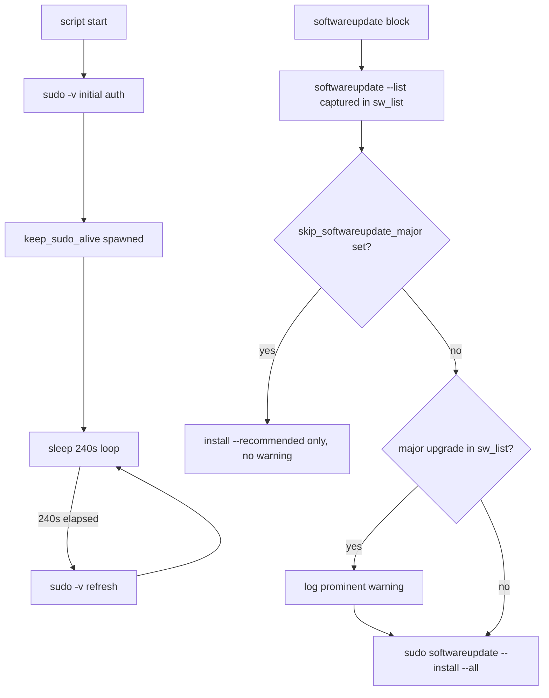

# Design Document: sudo-auth

## Overview

This feature delivers two targeted fixes to `htotheizzo.sh` that reduce unnecessary Touch ID prompts and add a clear warning before a major macOS OS upgrade is installed.

**Purpose**: Improve the operator experience on macOS by aligning credential refresh timing with the sudo credential window and surfacing an actionable warning when `softwareupdate` would install a major OS upgrade.

**Users**: macOS users running `htotheizzo.sh` interactively with Touch ID-enabled sudo (`pam_tid`).

**Impact**: Changes one constant in `keep_sudo_alive()` and adds a detection-and-warning block in the `softwareupdate` section. No behavior change on Linux or when `skip_softwareupdate_major=1` is set.

### Goals
- Reduce Touch ID prompts to at most one per 5-minute sudo credential window
- Warn the user before a major OS upgrade installation requires an interactive password
- Preserve all existing behavior on non-macOS platforms and for non-major updates

### Non-Goals
- Modifying PAM configuration or the sudo credential timeout
- Suppressing the macOS interactive password requirement for major upgrades
- Changing the initial `sudo -v` auth gate or any other sudo call in the script
- Adding new skip flags beyond the existing `skip_softwareupdate_major`

## Boundary Commitments

### This Spec Owns
- The `sleep` interval inside `keep_sudo_alive()` (lines 72–77 of `htotheizzo.sh`)
- The major-upgrade detection heuristic and warning log immediately before the `softwareupdate --install --all` call (lines 993–1010 of `htotheizzo.sh`)

### Out of Boundary
- PAM configuration, `sudoers` TTL changes, or launchd credential-extension techniques
- Other `sudo` calls throughout the script
- The initial `sudo -v` prompt at script start
- Linux/Windows update paths (interval change is safe; no platform-specific logic added)

### Allowed Dependencies
- `sw_vers -productVersion` — reads current macOS version (standard macOS CLI, always present)
- `softwareupdate --list` output already captured in `sw_list` — no additional subprocess added
- Existing `log` and `progress` shell functions in `htotheizzo.sh`

### Revalidation Triggers
- If Apple changes the `softwareupdate --list` output schema (e.g., removes "Version:" field) — update detection heuristic
- If macOS sudo credential TTL changes from 5 minutes — recalculate `sleep` interval
- If `keep_sudo_alive()` is refactored (e.g., moved to a shared lib) — verify interval constant travels with it

## Architecture

### Existing Architecture Analysis

`htotheizzo.sh` is a single monolithic Bash script with no modules or imports. All logic lives in shell functions. The two affected areas are isolated:

1. **`keep_sudo_alive()`** (lines 72–77): spawns a background loop that calls `sudo -v` then sleeps. The only change is the sleep constant.

2. **softwareupdate block** (lines 993–1010): captures `sw_list` via `softwareupdate --list`, logs it, then branches on `skip_softwareupdate_major`. The addition inserts a detection step between the list capture and the install call.

### Architecture Pattern & Boundary Map



### Technology Stack

| Layer | Choice / Version | Role in Feature |
|-------|-----------------|-----------------|
| Shell script | Bash (existing) | Only file changed; no new dependencies |
| macOS CLI | `sw_vers` (built-in) | Read current major version for detection heuristic |
| macOS CLI | `softwareupdate --list` (existing call) | Already captured; output reused for major-upgrade detection |

## File Structure Plan

### Modified Files
- `htotheizzo.sh` — Two localized changes:
  1. `keep_sudo_alive()` function: change `sleep 50` → `sleep 240`
  2. `softwareupdate` block: insert major-upgrade detection and warning between list capture and install call

No new files are created by this feature.

## System Flows

The flowchart in Architecture covers the branching logic. No additional diagrams needed.

## Requirements Traceability

| Requirement | Summary | Components | Notes |
|-------------|---------|------------|-------|
| 1.1 | Refresh no more than once per 240s | `keep_sudo_alive()` interval | `sleep 50` → `sleep 240` |
| 1.2 | At most one Touch ID prompt per 5-min window | `keep_sudo_alive()` interval | Satisfied by 1.1; 240s < 300s timeout |
| 1.3 | Non-macOS equivalence | `keep_sudo_alive()` interval | 240s is safe on Linux; loop logic unchanged |
| 2.1 | Warn when major upgrade detected | `MajorUpgradeGuard` | Detection heuristic compares version majors |
| 2.2 | Warning states interactive password required | `MajorUpgradeGuard` | Warning message content |
| 2.3 | Warning mentions `skip_softwareupdate_major=1` | `MajorUpgradeGuard` | Warning message content |
| 2.4 | No warning when no major upgrade present | `MajorUpgradeGuard` | Guard exits silently if no major found |
| 2.5 | Resilient detection heuristic | `MajorUpgradeGuard` | Pattern matches "Version: N"; not hardcoded names |
| 2.6 | No warning when `skip_softwareupdate_major=1` | `MajorUpgradeGuard` | Guard only runs when flag is unset |

## Components and Interfaces

| Component | Layer | Intent | Req Coverage | Key Dependencies |
|-----------|-------|--------|--------------|-----------------|
| KeepAliveInterval | Shell function | Sleep constant determining credential refresh cadence | 1.1, 1.2, 1.3 | None |
| MajorUpgradeGuard | Shell inline block | Detect major OS upgrades in sw_list and emit warning | 2.1–2.6 | `sw_vers`, existing `sw_list` var, `log` function |

### Shell Layer

#### KeepAliveInterval

| Field | Detail |
|-------|--------|
| Intent | Control how frequently `keep_sudo_alive()` calls `sudo -v` |
| Requirements | 1.1, 1.2, 1.3 |

**Responsibilities & Constraints**
- Change the sleep constant from 50 to 240 seconds
- The loop structure and all other behavior of `keep_sudo_alive()` remain unchanged
- 240s is unconditionally safe on all platforms (shorter than sudo TTL on Linux too)

**Contracts**: none (internal constant change)

**Implementation Notes**
- Single-line change: `sleep 50` → `sleep 240` in `keep_sudo_alive()`
- Risk: none — arithmetic is the only concern; 240 < 300 (macOS sudo TTL) confirmed

---

#### MajorUpgradeGuard

| Field | Detail |
|-------|--------|
| Intent | Detect major OS upgrade in `sw_list` output and log a prominent warning before installation |
| Requirements | 2.1, 2.2, 2.3, 2.4, 2.5, 2.6 |

**Responsibilities & Constraints**
- Runs only when `skip_softwareupdate_major` is unset (requirement 2.6: guard is bypassed when the flag is set, since no major upgrade will be installed)
- Reads `sw_vers -productVersion` to extract the current major version integer
- Parses `sw_list` for `Version: N` patterns; compares each `N` to current major
- If any update has a different (higher) major: calls `log` with a multi-line prominent warning
- Does not modify `sw_list`, does not launch any new subprocess beyond `sw_vers`

**Detection Heuristic** (resilient, not a rigid parser):
```
current_major = sw_vers -productVersion | cut -d. -f1    # e.g. "15"
for each "Version: X.Y" in sw_list:
    if X != current_major → major upgrade detected
```
Pattern match on integer-prefixed version numbers avoids dependence on macOS release name strings (requirement 2.5).

**Warning Message Contract** (must include, in order):
1. A `⚠` or `WARNING` indicator visible in the `log` output
2. Statement that a major OS upgrade is available (include version if detectable)
3. Statement that installation will require an interactive password (bypasses sudo credential cache)
4. Reminder: set `skip_softwareupdate_major=1` to skip major upgrades

**Dependencies**
- Inbound: `sw_list` (already populated in softwareupdate block) — `P0`
- Outbound: `log` function — `P0`
- External: `sw_vers -productVersion` — `P0` (standard macOS binary, always present)

**Contracts**: none (no exported interface; inline shell block)

**Implementation Notes**
- Integration: insert detection block between `sw_list` capture and the `if [[ -z "${skip_softwareupdate_major:-}" ]]` branch — inside the outer `if [[ -z "${skip_softwareupdate}" ]]` guard
- Validation: manually test with mocked `sw_list` containing "Version: 26" while on macOS 15
- Risk: `sw_vers` absence — not possible on macOS; no guard needed
- Risk: heuristic false positive (e.g., minor update misread as major) — mitigated by extracting only the integer before the first `.` in the version field

## Error Handling

### Error Strategy
Both changes follow the existing script pattern: failures are logged as warnings and do not halt the script.

- If `sw_vers -productVersion` returns unexpected output: detection heuristic falls back to no-warning (safe default — does not block installation)
- If `softwareupdate --install --all` fails: existing `|| log "Warning: ..."` handler covers it (unchanged)
- Keepalive `sudo -v` failures: already handled by `2>/dev/null` in the existing loop

## Testing Strategy

### Manual / Smoke Tests
1. **Keepalive interval**: Confirm `keep_sudo_alive()` contains `sleep 240` (grep check); run script and observe that only one Touch ID prompt fires in the first 5 minutes
2. **Major upgrade detected**: Mock `sw_list` with a "Version: 26" line while on macOS 15; verify warning is printed containing "interactive password" and "skip_softwareupdate_major=1"
3. **No major upgrade**: Mock `sw_list` with only "Version: 15" lines; verify no warning is printed
4. **skip_softwareupdate_major=1 set**: Set flag and mock a major-upgrade `sw_list`; verify no warning is printed and `--recommended` is used
5. **Non-macOS path**: On Linux, confirm keepalive loop runs without error (240s interval accepted)
