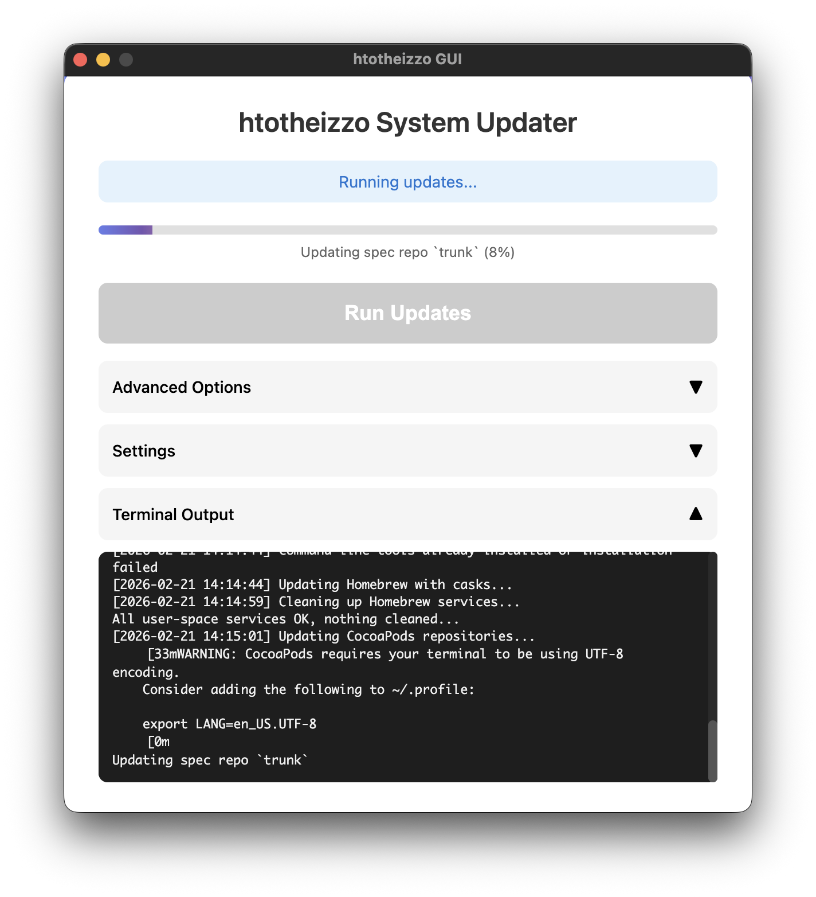

# htotheizzo

[](https://gitter.im/yanicklandry/htotheizzo?utm_source=badge&utm_medium=badge&utm_campaign=pr-badge&utm_content=badge)

**A comprehensive system update automation script that updates 50+ package managers and development tools across macOS, Linux, and Windows.**

Update all your package managers with a single command! htotheizzo handles Homebrew, apt-get, npm, pip, gems, and dozens of other package managers in one go.

Originally inspired by https://gist.github.com/jfrazelle/57dbf1fccfa02151ff3f, now significantly expanded.

## Features

- **50+ Package Managers**: Covers virtually every major package manager and version manager
- **Cross-Platform**: Works on macOS, Linux (including Ubuntu, Debian, Raspberry Pi), and Windows
- **Modern GUI**: Electron-based GUI with Touch ID support for macOS
- **Smart Skip System**: Skip any package manager using environment variables
- **Native Authentication**: Uses system authentication dialogs with Touch ID support
- **Comprehensive Maintenance**: Includes system cleanup, cache clearing, and optimization
- **Safe Error Handling**: Graceful failure handling - one failed update won't stop others
- **Self-Updating**: Automatically updates itself via git

### Supported Package Managers

**System Packages:** Homebrew, MacPorts, Mac App Store (mas), apt, snap, flatpak, Nix

**JavaScript/Node.js:** npm, yarn, pnpm, Bun, Deno, nvm, nodenv

**Python:** pip, pipenv, Poetry, PDM, uv, Conda, Mamba, pyenv

**Ruby:** gem, rvm, rbenv

**Other Languages:** Rust (rustup/cargo), Go, PHP (Composer), Perl (CPAN)

**Version Managers:** asdf, mise, pyenv, rbenv, nvm, nodenv, rvm, goenv, jenv, SDKMAN, tfenv

**Cloud & Infrastructure:** Docker, Helm, kubectl, GitHub CLI, Google Cloud SDK, AWS CLI, Azure CLI

**Development Tools:** VS Code, CocoaPods, Flutter, tmux plugins

**Shell Customization:** Oh My Zsh, Zinit, Antibody, Antigen, Fisher, Starship

**macOS Maintenance:** Disk verification, cache clearing, Spotlight rebuild, Launchpad reset

## Requirements

Optional : https://github.com/kcrawford/dockutil to auto update from Dock

## Setup

```
mkdir -p ~/bin # Make sure directory exists
git clone https://github.com/yanicklandry/htotheizzo.git ~/bin/.htotheizzo # Clone to local
ln -s ~/bin/.htotheizzo/htotheizzo.sh ~/bin/htotheizzo.sh # Link
chmod a+x ~/bin/htotheizzo.sh # Permissions
echo 'export PATH="$PATH:$HOME/bin"' >> ~/.bashrc # Make sure directory is executable
source ~/.bashrc
```

### Setup on Linux

On Linux, do this additional step to allow you to run HomeBrew on Linux as root :

```
sudo echo "sudo -u $(whoami) $(which brew) \$@" > /usr/local/bin/brew
sudo chmod a+x /usr/local/bin/brew
```

## Usage

### Command Line

It's better to have sudo authorization while still being logged as your user. For example :

```bash
sudo ls
# enter your password
htotheizzo.sh
```

### GUI Mode

Launch the modern Electron GUI:

```bash
htotheizzo-gui
```



The GUI provides:
- Visual interface with checkboxes for all package managers
- Real-time update progress display
- Touch ID authentication on macOS
- Organized categories for easy selection

### Skip Specific Package Managers

You can skip any package manager using environment variables:

```bash
# Skip specific tools
skip_kav=1 skip_mas=1 htotheizzo.sh

# Skip Docker cleanup and cloud tools
skip_docker=1 skip_gcloud=1 skip_aws=1 htotheizzo.sh

# Skip all Python tools
skip_pip=1 skip_pip3=1 skip_poetry=1 skip_conda=1 htotheizzo.sh
```

All available skip variables: `skip_brew`, `skip_mas`, `skip_snap`, `skip_flatpak`, `skip_bun`, `skip_npm`, `skip_yarn`, `skip_pnpm`, `skip_deno`, `skip_pip`, `skip_pip3`, `skip_pipenv`, `skip_poetry`, `skip_pdm`, `skip_uv`, `skip_conda`, `skip_mamba`, `skip_gem`, `skip_rvm`, `skip_rbenv`, `skip_rustup`, `skip_cargo`, `skip_go`, `skip_composer`, `skip_cpan`, `skip_asdf`, `skip_mise`, `skip_nvm`, `skip_nodenv`, `skip_pyenv`, `skip_goenv`, `skip_jenv`, `skip_sdk`, `skip_tfenv`, `skip_docker`, `skip_helm`, `skip_kubectl`, `skip_gh`, `skip_gcloud`, `skip_aws`, `skip_az`, `skip_code`, `skip_pod`, `skip_flutter`, `skip_omz`, `skip_antibody`, `skip_fisher`, `skip_starship`, `skip_port`, `skip_nix-env`, `skip_kav`, `skip_apm`, `skip_spotlight`, `skip_launchpad`

## Automated Scheduling with Cron

For automatic updates, you can schedule htotheizzo using cron. The recommended frequency is **weekly** as it provides a good balance between keeping packages updated for security and maintaining system stability.

Here are recommended schedules:

### Weekly Updates (Recommended)
```bash
# Edit crontab
crontab -e

# Add this line for weekly updates on Sundays at 2 AM (replace 'username' with your actual username)
0 2 * * 0 /Users/username/bin/htotheizzo.sh >> /Users/username/logs/htotheizzo.log 2>&1
```

### Other Scheduling Options
```bash
# Daily updates at 3 AM (for development machines)
0 3 * * * /Users/username/bin/htotheizzo.sh >> /Users/username/logs/htotheizzo.log 2>&1

# Bi-weekly updates (1st and 15th of each month at 2 AM)
0 2 1,15 * * /Users/username/bin/htotheizzo.sh >> /Users/username/logs/htotheizzo.log 2>&1

# Weekday updates at 1 AM (Monday-Friday)
0 1 * * 1-5 /Users/username/bin/htotheizzo.sh >> /Users/username/logs/htotheizzo.log 2>&1
```

### Setup Steps for Automated Updates

1. **Create log directory:**
   ```bash
   mkdir -p ~/logs
   ```

2. **Get your username and script path:**
   ```bash
   whoami
   which htotheizzo.sh
   # Use these exact paths in your crontab (replace 'username' in examples above)
   ```

3. **Add to crontab:**
   ```bash
   # If you get editor errors, set the editor first:
   export EDITOR=nano
   crontab -e
   # Add your chosen schedule from above
   
   # Alternative: Create crontab file directly
   echo "0 2 * * 0 /Users/$(whoami)/bin/htotheizzo.sh >> /Users/$(whoami)/logs/htotheizzo.log 2>&1" | crontab -
   ```

4. **Verify cron job:**
   ```bash
   crontab -l
   ```

### Important Cron Considerations

- **MacBook sleep mode**: Cron jobs won't run when your MacBook lid is closed (sleep mode). For reliable automation, keep your MacBook plugged in and awake, or use `caffeinate` command
- **Sudo access**: For automated runs, consider configuring passwordless sudo for specific commands or run as root (not recommended)
- **Environment variables**: Cron has a minimal environment, so use full paths
- **Logging**: Always redirect output to a log file to troubleshoot issues
- **Network connectivity**: Ensure the system has internet access during scheduled runs
- **System load**: Schedule during low-usage periods (typically early morning)

### Keeping MacBook Awake for Cron Jobs

If you want cron jobs to run with the lid closed:

```bash
# Prevent sleep while plugged in (run before closing lid)
sudo pmset -c sleep 0

# Or use caffeinate to keep system awake during updates
0 2 * * 0 /usr/bin/caffeinate -s /Users/username/bin/htotheizzo.sh >> /Users/username/logs/htotheizzo.log 2>&1

# Reset sleep settings (optional)
sudo pmset -c sleep 10
```
